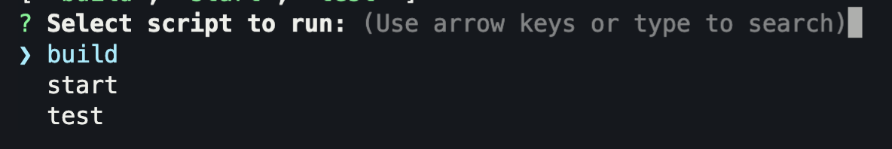
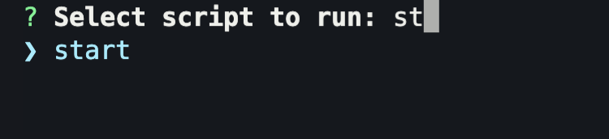

# package-json-scripts-cli

CLI tool for easily finding and running scripts in the `package.json` of the current directory, complete with autcompletion.

## Build

```bash
nvm use
yarn install
yarn build
# Creates: output/index.js
```

## Run

```bash
yarn start
```

**Choose script to run:**



**Autocompletion:**



## Tech

- [NodeJS](https://nodejs.org/) - runtime
- [inquirer](https://github.com/SBoudrias/Inquirer.js) - CLI prompts
- [inquirer-autocomplete-prompt](https://github.com/mokkabonna/inquirer-autocomplete-prompt) - autocomplete list
- [fuzzy](https://github.com/mattyork/fuzzy) - fuzzy string search
- [rollup](https://rollupjs.org/) - bundler
